# Technical Indicators Module — Dependency Graph

## High-Level Architecture

```
┌─────────────────────────────────────────────────────────────────────────────┐
│                          TECHNICAL INDICATORS MODULE                          │
├─────────────────────────────────────────────────────────────────────────────┤
│                                                                              │
│  ┌──────────────┐    ┌──────────────┐    ┌──────────────┐    ┌───────────┐ │
│  │  OHLCV Data  │───▶│  Indicators  │───▶│   Service    │───▶│   API/    │ │
│  │  (Input)     │    │  (Compute)   │    │  (Orchestrate)│    │   Tasks   │ │
│  └──────────────┘    └──────────────┘    └──────────────┘    └───────────┘ │
│         ▲                   ▲                   ▲                   ▲        │
│         │                   │                   │                   │        │
│         ▼                   ▼                   ▼                   ▼        │
│  ┌──────────────────────────────────────────────────────────────────────┐   │
│  │                        CORE INFRASTRUCTURE                              │   │
│  │  BaseIndicator ◀── IndicatorRegistry ◀── IndicatorFactory             │   │
│  │       ▲                   ▲                    ▲                       │   │
│  │       │                   │                    │                       │   │
│  │  IndicatorConfig      IndicatorType        IndicatorBuilder            │   │
│  └──────────────────────────────────────────────────────────────────────┘   │
│                                                                              │
└─────────────────────────────────────────────────────────────────────────────┘
```

## Module Dependencies (DAG)

```mermaid
graph TD
    %% Core
    core_constants[core.constants]
    core_models[core.models.BaseModel]
    core_protocols[core.protocols.Identifiable]
    core_repo[core.repository.BaseRepository]
    core_utils[core.utils.get_now]
    core_exceptions[core.exceptions.TradeVisionError]
    core_market_data[core.market_data.base_provider.OHLCVBar]
    core_tasks[core.tasks.BaseTask]
    core_events[core.events.EventBus]
    
    %% Django
    django_models[django.db.models]
    django_admin[django.contrib.admin]
    drf[rest_framework]
    django_filters[django_filters]
    celery[celery]
    factory_boy[factory_boy]
    
    %% Batch 1: Core Indicator Infrastructure
    exceptions[indicators.exceptions.IndicatorError]
    base[indicators.base.BaseIndicator]
    base_config[indicators.base.IndicatorConfig]
    base_result[indicators.base.IndicatorResult]
    base_type[indicators.base.IndicatorType]
    registry[indicators.registry.IndicatorRegistry]
    factory[indicators.factory.IndicatorFactory]
    builder[indicators.factory.IndicatorBuilder]
    
    %% Batch 2: Trend Indicators
    sma[indicators.trend.sma.SMA]
    ema[indicators.trend.ema.EMA]
    macd[indicators.trend.macd.MACD]
    adx[indicators.trend.adx.ADX]
    
    %% Batch 3: Momentum Indicators
    rsi[indicators.momentum.rsi.RSI]
    stochastic[indicators.momentum.stochastic.StochasticOscillator]
    
    %% Batch 4: Volatility Indicators
    bollinger[indicators.volatility.bollinger.BollingerBands]
    atr[indicators.volatility.atr.ATR]
    
    %% Batch 5: Volume Indicators
    obv[indicators.volume.obv.OBV]
    vwap[indicators.volume.vwap.VWAP]
    volume_profile[indicators.volume.volume_profile.VolumeProfile]
    
    %% Batch 6: Django Models
    models_result[models.IndicatorResult]
    models_config[models.IndicatorConfiguration]
    models_snapshot[models.IndicatorSnapshot]
    models_ohlcv[models.OHLCVSnapshot]
    admin[admin.IndicatorAdmin]
    
    %% Batch 7: Repository & Service
    repo_result[repository.IndicatorResultRepository]
    repo_config[repository.IndicatorConfigurationRepository]
    service[services.IndicatorService]
    
    %% Batch 8: API
    serializers[serializers.IndicatorSerializer]
    views[views.IndicatorViewSet]
    urls[urls.router]
    
    %% Batch 9: Tasks
    tasks[tasks.ComputeIndicatorsTask]
    apps[apps.TechnicalAnalysisConfig]
    
    %% Batch 10: Test Factories
    factories[tests.factories]
    
    %% Batch 11: Unit Tests
    test_sma[tests.test_indicators.test_sma]
    test_ema[tests.test_indicators.test_ema]
    test_rsi[tests.test_indicators.test_rsi]
    test_macd[tests.test_indicators.test_macd]
    test_bollinger[tests.test_indicators.test_bollinger]
    test_atr[tests.test_indicators.test_atr]
    test_adx[tests.test_indicators.test_adx]
    test_stochastic[tests.test_indicators.test_stochastic]
    test_obv[tests.test_indicators.test_obv]
    test_vwap[tests.test_indicators.test_vwap]
    test_volume_profile[tests.test_indicators.test_volume_profile]
    
    %% Batch 12: Integration Tests
    test_factory[tests.test_factory]
    test_registry[tests.test_registry]
    test_service[tests.test_service]
    test_repository[tests.test_repository]
    test_models[tests.test_models]
    test_api[tests.test_api]
    test_tasks[tests.test_tasks]
    
    %% Dependencies
    base --> core_market_data
    base --> core_constants
    base --> core_exceptions
    base_config --> core_exceptions
    base_result --> core_utils
    base_type --> core_constants
    registry --> base
    registry --> base_type
    factory --> registry
    factory --> base
    factory --> base_config
    builder --> factory
    
    sma --> base
    sma --> base_config
    sma --> base_result
    sma --> base_type
    sma --> core_market_data
    
    ema --> base
    ema --> base_config
    ema --> base_result
    ema --> base_type
    ema --> core_market_data
    
    macd --> base
    macd --> base_config
    macd --> base_result
    macd --> base_type
    macd --> core_market_data
    macd --> ema
    
    adx --> base
    adx --> base_config
    adx --> base_result
    adx --> base_type
    adx --> core_market_data
    
    rsi --> base
    rsi --> base_config
    rsi --> base_result
    rsi --> base_type
    rsi --> core_market_data
    
    stochastic --> base
    stochastic --> base_config
    stochastic --> base_result
    stochastic --> base_type
    stochastic --> core_market_data
    
    bollinger --> base
    bollinger --> base_config
    bollinger --> base_result
    bollinger --> base_type
    bollinger --> core_market_data
    bollinger --> sma
    
    atr --> base
    atr --> base_config
    atr --> base_result
    atr --> base_type
    atr --> core_market_data
    
    obv --> base
    obv --> base_config
    obv --> base_result
    obv --> base_type
    obv --> core_market_data
    
    vwap --> base
    vwap --> base_config
    vwap --> base_result
    vwap --> base_type
    vwap --> core_market_data
    
    volume_profile --> base
    volume_profile --> base_config
    volume_profile --> base_result
    volume_profile --> base_type
    volume_profile --> core_market_data
    
    models_result --> core_models
    models_result --> core_protocols
    models_result --> core_utils
    models_config --> core_models
    models_snapshot --> core_models
    models_ohlcv --> core_models
    admin --> models_result
    admin --> models_config
    admin --> models_snapshot
    admin --> django_admin
    
    repo_result --> core_repo
    repo_result --> models_result
    repo_config --> core_repo
    repo_config --> models_config
    service --> repo_result
    service --> repo_config
    service --> factory
    service --> registry
    service --> core_events
    service --> core_utils
    service --> core_constants
    
    serializers --> models_result
    serializers --> models_config
    serializers --> base_type
    serializers --> drf
    
    views --> serializers
    views --> service
    views --> base_type
    views --> drf
    views --> django_filters
    
    urls --> views
    
    tasks --> core_tasks
    tasks --> service
    tasks --> base_type
    tasks --> core_constants
    tasks --> core_events
    
    apps --> tasks
    
    factories --> models_result
    factories --> models_config
    factories --> models_snapshot
    factories --> core_market_data
    factories --> base_type
    factories --> factory_boy
    
    test_sma --> sma
    test_sma --> factories
    test_sma --> core_market_data
    
    test_ema --> ema
    test_ema --> factories
    test_ema --> core_market_data
    
    test_rsi --> rsi
    test_rsi --> factories
    test_rsi --> core_market_data
    
    test_macd --> macd
    test_macd --> factories
    test_macd --> core_market_data
    
    test_bollinger --> bollinger
    test_bollinger --> factories
    test_bollinger --> core_market_data
    
    test_atr --> atr
    test_atr --> factories
    test_atr --> core_market_data
    
    test_adx --> adx
    test_adx --> factories
    test_adx --> core_market_data
    
    test_stochastic --> stochastic
    test_stochastic --> factories
    test_stochastic --> core_market_data
    
    test_obv --> obv
    test_obv --> factories
    test_obv --> core_market_data
    
    test_vwap --> vwap
    test_vwap --> factories
    test_vwap --> core_market_data
    
    test_volume_profile --> volume_profile
    test_volume_profile --> factories
    test_volume_profile --> core_market_data
    
    test_factory --> factory
    test_factory --> builder
    test_factory --> registry
    test_factory --> factories
    
    test_registry --> registry
    test_registry --> factories
    
    test_service --> service
    test_service --> factories
    test_service --> core_events
    
    test_repository --> repo_result
    test_repository --> repo_config
    test_repository --> factories
    
    test_models --> models_result
    test_models --> models_config
    test_models --> models_snapshot
    test_models --> factories
    
    test_api --> views
    test_api --> factories
    test_api --> drf
    
    test_tasks --> tasks
    test_tasks --> factories
    test_tasks --> celery
```



## Import Flow (Runtime)

```
apps.technical_analysis.indicators.__init__
    ├── base (BaseIndicator, IndicatorConfig, IndicatorResult, IndicatorType)
    ├── registry (IndicatorRegistry, register_indicator)
    ├── factory (IndicatorFactory, IndicatorBuilder)
    ├── exceptions (IndicatorError, InsufficientDataError, InvalidParameterError)
    ├── trend (SMA, EMA, MACD, ADX)
    ├── momentum (RSI, StochasticOscillator)
    ├── volatility (BollingerBands, ATR)
    └── volume (OBV, VWAP, VolumeProfile)

apps.technical_analysis.services.IndicatorService
    ├── factory (IndicatorFactory)
    ├── registry (IndicatorRegistry)
    ├── repository (IndicatorResultRepository, IndicatorConfigurationRepository)
    ├── events (EventBus, EventType.COMPUTE_INDICATORS)
    └── constants (TaskName.COMPUTE_INDICATORS, QueueName.PROCESSING)

apps.technical_analysis.tasks.ComputeIndicatorsTask
    ├── services (IndicatorService)
    ├── constants (TaskName.COMPUTE_INDICATORS, QueueName.PROCESSING)
    └── events (EventBus)

apps.technical_analysis.views.IndicatorViewSet
    ├── serializers (IndicatorResultSerializer, IndicatorConfigSerializer)
    ├── services (IndicatorService)
    └── indicators.base (IndicatorType)
```

## Circular Dependency Prevention Rules

1. **Indicators never import from services, tasks, views, models, or repository**
2. **Services import from indicators (factory, registry) but not from tasks/views**
3. **Tasks import from services but not from views**
4. **Views import from services and serializers but not from tasks**
5. **Models only import from core.*, django.*, and stdlib**
6. **Repository only imports from core.repository and models**
7. **Tests import from implementation but implementation never imports from tests**

## Type Dependencies

```
OHLCVBar (core.market_data.base_provider) ───▶ All Indicator.compute() methods
    ├── timestamp: datetime (tz-aware)
    ├── open_price: Decimal
    ├── high: Decimal
    ├── low: Decimal
    ├── close_price: Decimal
    └── volume: int

IndicatorConfig (base) ───▶ All Indicator constructors
    ├── period: int
    ├── source: PriceSource (OPEN, HIGH, LOW, CLOSE, VWAP, HL2, HLC3, OHLC4)
    └── kwargs: dict[str, Any]

IndicatorResult (base) ───▶ All Indicator.compute() return
    ├── indicator_type: IndicatorType
    ├── symbol: str
    ├── interval: str
    ├── timestamp: datetime (tz-aware)
    ├── values: dict[str, Decimal]  # e.g. {"sma": 150.25}
    ├── metadata: dict[str, Any]    # e.g. {"period": 20}
    └── computed_at: datetime

IndicatorType (base.IndicatorType enum) ───▶ Registry, Factory, Service, Models
    SMA, EMA, MACD, ADX, RSI, STOCHASTIC, BOLLINGER_BANDS, ATR, OBV, VWAP, VOLUME_PROFILE
```

## Data Flow

```
Market Data Ingestion
        │
        ▼
┌───────────────────┐
│  OHLCVSnapshot    │  (models.OHLCVSnapshot - persisted raw bars)
└─────────┬─────────┘
          │
          ▼
┌───────────────────┐
│  IndicatorService │  compute(symbol, interval, indicator_types, bars)
└─────────┬─────────┘
          │
          ▼
┌───────────────────┐
│  IndicatorFactory │  create(indicator_type, config)
└─────────┬─────────┘
          │
          ▼
┌───────────────────┐
│  BaseIndicator    │  compute(bars: Sequence[OHLCVBar]) -> IndicatorResult
│  (concrete impl)  │
└─────────┬─────────┘
          │
          ▼
┌───────────────────┐
│  IndicatorResult  │  (dataclass - typed result)
└─────────┬─────────┘
          │
          ▼
┌───────────────────┐
│  IndicatorResult  │  (models.IndicatorResult - persisted)
│  Repository       │
└───────────────────┘
```

## Configuration Matrix

| Indicator | Required Params | Optional Params | IndicatorType |
|-----------|----------------|-----------------|---------------|
| SMA | period | source=CLOSE | SMA |
| EMA | period | source=CLOSE, alpha=None | EMA |
| MACD | fast=12, slow=26, signal=9 | source=CLOSE | MACD |
| ADX | period=14 | - | ADX |
| RSI | period=14 | source=CLOSE | RSI |
| STOCHASTIC | k_period=14, d_period=3 | - | STOCHASTIC |
| BOLLINGER_BANDS | period=20, std_dev=2 | source=CLOSE | BOLLINGER_BANDS |
| ATR | period=14 | - | ATR |
| OBV | - | - | OBV |
| VWAP | - | anchor=SESSION | VWAP |
| VOLUME_PROFILE | period=20, bins=50 | - | VOLUME_PROFILE |